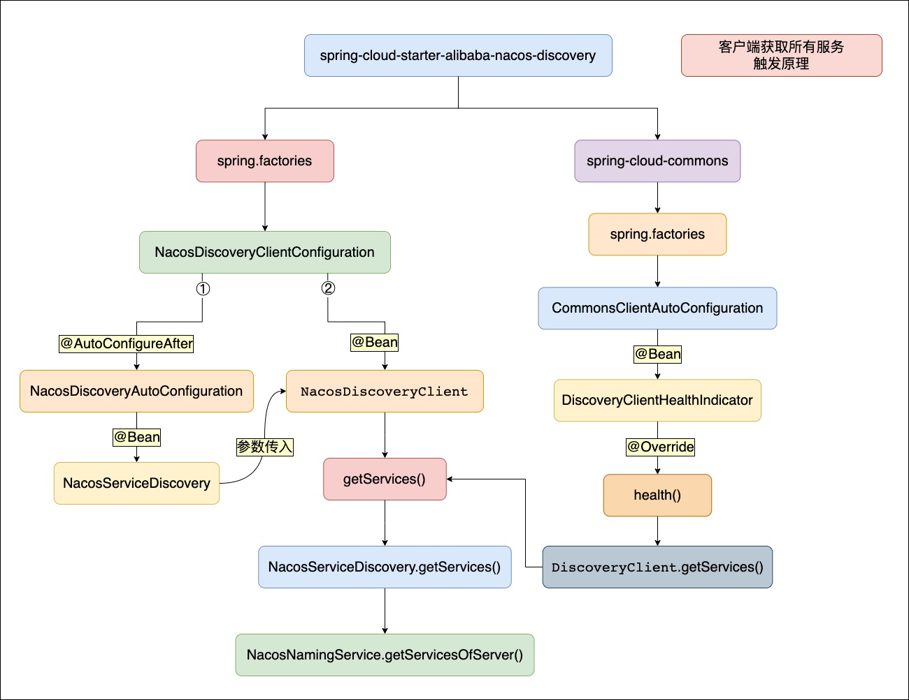
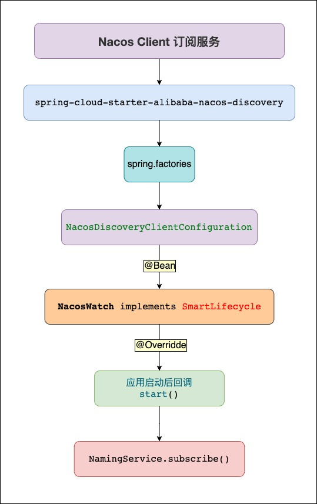

# Nacos: Dynamic  *Na*ming and *Co*nfiguration *S*ervice

---

nacos：1.4.1

spring-boot：2.3.2.RELEASE

spring-cloud-alibaba：2.2.5.RELEASE

---

consistency 模块缺失 entity 包中的代码，需要下载插件 protoc 手动生成。

解决方案参考：https://www.jianshu.com/p/99c48ca4bb72

---

### 几种常见注册中心的对比

| 对比项           | Zookeeper      | Eureka           | consul         | Nacos            |
| ---------------- | -------------- | ---------------- | -------------- | ---------------- |
| CAP              | CP（强一致性） | AP（最终一致性） | CP（强一致性） | CP/AP（默认 AP） |
| 一致性算法       | Paxos          | -                | Raft           | Raft             |
| 自我保护机制     | 无             | 有               | 无             | 有               |
| SpringCloud 集成 | 支持           | 支持             | 支持           | 支持             |
| Dubbo 集成       | 支持           | 不支持           | 支持           | 支持             |
| K8s 集成         | 不支持         | 不支持           | 支持           | 支持             |


---

### **Nacos 系统架构**


Nacos 内部提供了 Config Service 和 Naming Service，底层由 Nacos Core 提供支持，外层提供 OpenAPI 使用，并提供了 User Console、Admin Console 方便用户使用。

从架构图中可以看出，Nacos 提供了两种服务，一种是用于服务注册、服务发现的 Naming Service，一种是用于配置中心、动态配置的 Config Service，而他们底层均由 core 模块来支持。

- Provider APP：服务提供者
- Consumer APP：服务消费者
- Naming Server：通过 VIP(Vritual IP) 或者 DNS 的方式实现 Nacos 高可用集群的服务路由
- Nacos Server：Nacos 服务提供者，包含 OpenAPI 访问入口，Config Service 是 Nacos 的配置服务，Naming Service 是 Naocs 的名字服务模块，Consistency Protocol 是一致性协议，用来实现 Nacos 集群节点的数据同步，使用功能的是 Raft 算法
- Nacos Console：控制台

从 OpenAPI 可以了解到，Nacos 通过提供一系列的 http 接口来提供 Naming 服务和 Config 服务：

服务注册 URI：`/nacos/v1/ns/instance` POST请求

服务取消注册 URI：`/nacos/v1/ns/instance` DELETE 请求

心跳检测 URI：`/nacos/v1/ns/instance/beat` PUT 请求

……

都是遵循 REST API 的风格，Nacos 通过 HTTP 这样无状态的协议来进行 client-server 端的通信。

---

### Nacos 数据模型


一个 **namespace** 下可以包含有很多的 **group**，一个 **group** 下可以包含有很多的 **service**。但 **service** 并不是一个简单的微服务提供者，而是一类提供者的集合。**service** 除了包含微服务名称外，还可以包含很多的 **Cluster**，每个 **Cluster** 中可以包含很多的 **Instance** 提供者，**Instance** 才是真正的微服务提供者主机。

<br>

##### Nacos 注册表数据结构

nacos 是多级存储模型，最外层通过 namespace 来实现环境隔离，然后是 group 分组，分组下就是服务，一个服务又可以分为不同的集群，集群中包含多个实例，因此注册表结构为一个 Map，类型是：`Map<String,Map<String,Service>>`，外层 key 是 `namespace_id`，内层 key 是 `group+serviceName`，

Service 内部维护一个 Map，结构是：`Map<Strign,Cluster>`，key 是 `clusterName`，值是集群信息

Cluster 内部维护了一个 Set 集合，元素是 Instance 类型，代表集群中的多个实例。

```yaml
# nacos 客户端配置示例
spring:
    application:
        name: colin-nacos-consumer
    cloud:
        nacos:
            discovery:
                server-addr: localhost:8848
                # 名称空间，默认为 public
                namespace: my_namespace_id
                # 组名，默认为 DEFAULT_GROUP
                group: my_group
                # 集群名，默认为 DEFAULT
                cluster-name: myCluster
                # 是否是临时实例，默认为 true：是临时实例；false：永久实例
                ephemeral: true
```


**my_group%40%40colin-nacos-consumer@@myCluster**

- %40%40：@@ 符号
- my_group：组名，默认为 DEFAULT_GROUP
- colin-nacos-consumer：微服务名称
- myCluster：集群名称，默认为 DEFAULT

<br>

**临时实例**与**持久实例**的存储位置与健康检测机制是不同的。

1. **临时实例**：默认情况。服务实例仅会注册在 Nacos 内存中，不会持久化到 Nacos 磁盘。其健康检测机制为 Client 模式，即 Client 主动向 Server 上报其健康状态（属于推模式）。默认心跳间隔为 5s；并且在 15s 内 Server 端未收到 Client 心跳，则会将其标记为“**不健康**”状态；若在 30s 内收到了 Client 心跳，则重新恢复到”**健康**“状态，否则该实例将从 Server 端内存中**自动**清除。**适用于实例的弹性扩容场景**。
2. **持久实例**：服务实例不仅会注册到 Nacos 内存，同时也会被持久化到 Nacos 磁盘，其健康检测机制为 Server 模式，即 Server 会主动去检测 Client 的健康状态（属于拉模式）。默认每 20s 检测一次，健康检测失败后服务实例会被标记为“**不健康**”状态，但不会被清除，因为其是持久化在磁盘上了，因此对于”**不健康**“的实例的清除，需要专门进行。

---

### Nacos Client 重要 API

#### **Instance**

代表一个 Nacos Client 主机实例

```java
// 代表一个 Nacos Client 主机实例，继承了 pojo.Instance
public class Instance extends com.alibaba.nacos.api.naming.pojo.Instance implements Comparable{
  // 格式：192.168.1.8#8082#myCluster#my_group@@colin-nacos-provider。ip#端口号#集群名#组名@@服务名
  private String instanceId;

  // 仅标识临时实例的健康状态，"true"：健康；"false"：不健康
  private boolean healthy = true;
  // 仅标识持久实例健康状态，"true"：不健康；"false"：健康。「对临时实例无意义」
  private volatile boolean marked = false;

  // 是否是临时实例，true：临时实例（默认值），false：持久实例
  private boolean ephemeral = true
  // 集群名称
  private String clusterName;
  // 微服务名称，格式：my_group@@colin-nacos-provider
  private String serviceName
}
```

serviceName：并不是简单的微服务名称，其格式：groupId@@微服务名称，表示这是一个微服务名称，之所以要在微服务名称前加上 groupId 作为微服务名称，因为 Nacos 中允许在不同的 group 中存在相同的**微服务名称**的微服务应用，而这些应用提供不同的服务。

<br>

#### **ServiceInfo**

微服务信息

```java
// 微服务名称
private String name;

// 组名
private String groupName

// 一个或多个集群组成，多个集群使用逗号分隔
private String clusters;

// 当前微服务的所有提供者实例列表
private List<Instance> hosts = new ArrayList<Instance>();
```

<br>

#### **NacosNamingService**

可以完成 Client 与 Server 间的通信。例如："注册/取消注册"、"订阅/取消订阅"、"获取 Server 状态"、"获取 Server 中指定的 Instance"……**但心跳功能不是通过此类实现的**。

NacosNamingService 实例最终是通过调用 NamingProxy 实例完成的 client 与 server 之间的通信。

<br>

#### HostReactor

```java
// futureMap 是一个缓存 map，其 key 为 groupId@@微服务名称@@clusters，value 是一个定时异步操作对象「ScheduledFuture」
private final Map<String, ScheduledFuture<?>> futureMap = new HashMap<String, ScheduledFuture<?>>();

// serviceInfoMap：客户端本地注册表，key 为 groupId@@微服务名称@@cluster名称，value 为 ServiceInfo。
private final Map<String, ServiceInfo> serviceInfoMap;

// 用于存放当前正在发生变更的服务，key：serviceName，groupId@@微服务名称；value：new Object()，没有实际意义。
// 其就是利用了 map 中 key 的唯一性特征，标记一个服务的 ServiceInfo 发生了变更
private final Map<String, Object> updatingMap;

// 用于处理心跳相关功能
private final BeatReactor beatReactor;

// 用于处理 Client 向 Server 端发送请求
private final NamingProxy serverProxy;
```

---

### **Nacos Client**：

#### Nacos Client 的注册与心跳

**分析入口:**

1. spring-cloud-starter-alibaba-nacos-discovery→spring-cloud-commons→spring.factories→**AutoServiceRegistrationAutoConfiguration.class**→@Autowired AutoServiceRegistration
2. spring-cloud-starter-alibaba-nacos-discovery→spring.factories→NacosServiceRegistryAutoConfiguration

> 若要使得某个注册中心与 Spring Cloud 整合后，完成客户端-Client 的自动注册，那么就需要该注册中心的客户端的依赖实现 AutoServiceRegistrationAutoConfiguration 的规范，确切的说是要自定义一个 Starter，完成 AutoServiceRegistration 实例的创建与注入。
>
> Nacos 客户端是基于 SpringBoot 的自动装配实现的，可以在 nacos-discovery 依赖中找到 nacos 自动装配信息 NacosServiceRegistryAutoConfiguration，它会创建 NacosAutoServiceRegistration，其是 AutoServiceRegistration 的实现类

```java
// 应用启动，加载 NacosServiceRegistryAutoConfiguration
public class NacosServiceRegistryAutoConfiguration {
    // 创建 NacosAutoServiceRegistration，是 AutoServiceRegistration 的实现类
    @Bean
	@ConditionalOnBean(AutoServiceRegistrationProperties.class)
	public NacosAutoServiceRegistration nacosAutoServiceRegistration(
		NacosServiceRegistry registry,
		AutoServiceRegistrationProperties autoServiceRegistrationProperties,
		NacosRegistration registration) {
        /**
         * 应用启动会注入 NacosServiceRegistryAutoConfiguration，就会创建 NacosAutoServiceRegistration
         * NacosAutoServiceRegistration 是 AbstractAutoServiceRegistration 的实现类，其实现了对 web 容器启动初始化的监听
         * Tomcat 启动后，就会触发其 onApplicationEvent() 回调方法的执行
         * 层层调用就会执行 NacosNamingService.registerInstance()，即 Nacos Client 的注册
         */
        return new NacosAutoServiceRegistration(registry,
                autoServiceRegistrationProperties, registration);
	}
}
```


<br>

**自动注册原理：**

其实就是利用了 Spring 事件机制完成的。Naocs 利用 Spring 的事件机制去实现，就是用 SpringCloud 中对于注册中心的一个标准，该标准就是 springcloud-commons 这个包规定的。其中 **AbstractAutoServiceRegistration**，这个类主要是完成自动注册的一个抽象流程，具体的注册逻辑就需要具体的注册中心自己实现，这个类是一个抽象类，同时也实现了 ApplicationListener 接口，并且接口泛型为 WebServerInitializedEvent，作用就是这个类具有了监听器的功能，监听的事件为 WebServerInitializedEvent，当监听到这个事件的时候，就调用 **onApplicationEvent** 方法，最终会调到 start() 方法，然后继续调用到 register 方法，实现注册。

<br>

**NacosAutoServiceRegistration 是如何完成自动注册的**？

1. **NacosAutoServiceRegistration** 在初始化时，其父类 AbstractAutoServiceRegistration 也被初始化了，
2. AbstractAutoServiceRegistration 实现了 **ApplicationListener**<WebServerInitializedEvent>，即实现了对 web 容器启动初始化的监听，web 服务初始化完成后，最终会执行其 bind 方法
3. Tomcat 启动后会触发监听器 ApplicationListener 调用 onApplicationEvent() 方法，发送事件，即 **AbstractAutoServiceRegistration.onApplicationEvent()**→**bind(event)**→AbstractAutoServiceRegistration.start()→register()→**AbstractAutoServiceRegistration.serviceRegistry.register()**→NacosServiceRegistry.register()→NamingService.registerInstance()→**NacosNamingService.registerInstance(String serviceName, String groupName, Instance instance)**，**即真正的客户端注册是通过 NacosNamingService 调用 registerInstance() 方法完成的。**
3. **即 NacosAutoServiceRegistration 实现了对 web 容器启动初始化的监听，Tomcat 启动后会触发 NacosAutoServiceRegistration 的回调，层层调用，就会执行客户端的注册请求。**

<br>

**NacosNamingService**

可以完成 Client 与 Server 间的通信，提供了以下功能：

1. 注册/取消注册
2. 订阅/取消订阅
3. 获取 server 状态
4. 获取 server 中指定的 Instance

<br>

#### Nacos Client 注册功能

**NacosNamingService.registerInstance**(String serviceName, String groupName, Instance instance)

```java
// Nacos Client 的注册(包括注册与心跳)
public void registerInstance(String serviceName, String groupName, Instance instance) throws NacosException {
    NamingUtils.checkInstanceIsLegal(instance);
    // 生成格式：my_group@@colin-nacos-consumer
    String groupedServiceName = NamingUtils.getGroupedName(serviceName, groupName);
    // 判断当前实例是否为临时实例「默认为临时实例」，临时实例基于心跳的方式做健康检测，永久实例则是由 nacos 主动探测实例的状态
    if (instance.isEphemeral()) {
        // 构建心跳信息数据
        BeatInfo beatInfo = beatReactor.buildBeatInfo(groupedServiceName, instance);
        // 临时实例，向服务端发送心跳请求。「定时任务」
        beatReactor.addBeatInfo(groupedServiceName, beatInfo);
    }
    // 向服务端发送注册请求，最终由 NacosProxy 的 registerService 方法处理
    serverProxy.registerService(groupedServiceName, groupName, instance);
}
```

1. **心跳请求**：BeatReactor.addBeatInfo(groupedServiceName, beatInfo)
    - nacos 实例分为临时实例与永久实例，临时实例时基于心跳的方式做健康检测，而永久实例则是由 nacos 主动探测实例状态。

    - 通过使用一个「one-shot action」一次性定时任务，来发送心跳请求，当 BeatTask 在执行完任务后会再创建一个相同的一次性定时任务，用于发送下一次的心跳请求，这样就实现了一次性定时任务的循环执行。

    - **发送心跳的定时任务是由一个新的线程执行的**。

    - groupedServiceName 的格式：**my_group@@colin-nacos-consumer**

    - beatInfo：心跳信息数据

    - 客户端发送心跳的请求路径：/nacos/v1/ns/instance/beat

2. **注册请求**：NamingProxy.registerService(groupedServiceName, groupName, instance)
- 如果 Nacos 指定了连接的 server 地址，则尝试连接这个指定的 server 地址，若连接失败，会尝试连接三次（默认值，可配置），若始终失败，会抛出异常；
  
- 如果 Nacos 没有指定连接的 server 地址，Nacos 会首次按获取到其配置的所有 server 地址，然后再随机选择一个 server 进行连接，如果连接失败，其会以轮询方式再尝试连接下一台，直到将所有 server 都进行了尝试，如果最终没有任何一台能够连接成功，则会抛出异常；
  
- Nacos 底层是基于 HTTP 协议完成请求的，是使用 Nacos 自定义的一个 HttpClientRequest「JdkHttpClientRequest」发起请求。JdkHttpClientRequest 实现了对 JDK 中的 HttpURLConnection 的封装。

<br>

Nacos Client 向 Nacos Server 发送的注册、订阅、获取状态等连接请求是通过 NamingService 完成，但是心跳请求不是，心跳是通过 BeatReactor 提交的。而 Nacos Client 向 Nacos Server 发送的所有请求最终都是通过 NamingProxy 完成的提交。

Nacos Client 向 Nacos Server 发送的注册、订阅、获取状态等连接请求，是 NamingProxy 分别提交的 **POST**、**PUT**、**GET** 请求。最终是通过其自研的、封装了 JDK 的 HttpURLConnection 的 HttpClientRequest 发出的请求。

<br>

Nacos 如何保证并发读写的安全性

<br>

#### Nacos Client 获取所有服务名称列表

**NacosNamingService.getServicesOfServer()**



触发原理

1. 通过 spring-cloud-starter-alibaba-nacos-discovery 创建并加载了组件 NacosNamingService，并提供获取所有服务的方法，getServicesOfServer()
2. **Actuator 框架的 health() 机制，调用 NacosNamingService.getServicesOfServer()**

<br>

Nacos Discovery 应用在启动时会首先获取到所有可用的服务，对于这些服务的获取实际是在应用启动时，通过 Actuator 的 health 监控终端获取到的。

Nacos Discovery 应用在启动时会完成其必须的自动配置，会加载与创建 NacosDiscoveryAutoConfiguration 和 NacosDiscoveryClientConfiguration。

- NacosDiscoveryAutoConfiguration 主要用于创建一个 NacosDiscoveryClient 实例，而 NacosDiscoveryClient 主要用于进行服务发现，即获取所有指定的服务，或获取到与 Server 通信的 NamingService 等。
- NacosDiscoveryClientConfiguration 主要用于生成一个 DiscoveryClient 实例，而 DiscoveryClient 实例会通过 NacosServiceDiscovery 完成指定服务的获取
- NacosDiscoveryClientConfiguration 配置类要求必须在 NacosDiscoveryAutoConfiguration 配置类完成创建后才可创建，是通过注解 @AutoConfigureAfter 完成的。

<br>

#### Nacos Client 服务发现（默认开启订阅拉取）

**NacosNamingService.subscribe()**

触发原理



**Nacos Client 启动时会创建一个 NacosWatch 类实例，NacosWatch 实现了 SmartLifecycle 接口，应用启动后，会回调其 start() 方法， 即定时从 Nacos Server 端获取当前服务的所有实例并更新到本地。**

**Nacos 的服务发现的两种模式：**

1. 主动拉取模式，消费者定期主动从 nacos 拉取服务列表并缓存起来，在服务调用时优先读取本地缓存中的服务列表
2. 订阅模式，消费者订阅 nacos 中的服务列表，并基于 UDP 协议来接收服务变更通知，当 nacos 中的服务列表变更时，会发送 UDP 广播给所有订阅者。与 Eureka 相比，nacos 的订阅模式服务状态更新更及时，消费者更容易及时发现服务列表的变化，易剔除故障服务。

Nacos 的服务发现功能有两种实现方式，一种是客户端主动请求服务端拉取注册的实例，另一种是客户端对服务端进行订阅之后，当服务端注册的实例发生变更之后，服务端会主动推送注册实例给客户端。第一种主动拉取的模式比较简单其实就是客户端发起拉取请求之后然后服务端根据请求的内容去双层 map 结构中找到对应的注册实例返回给客户端，而第二种方式则比较复杂，需要服务端去进行数据的推送。


对于订阅拉取，首先会从 serviceInfoMap 中根据服务名称和集群名称去找到对应的 ServiceInfo 对象，这个 ServiceInfo 对象就是保存了对应服务和集群下的所有实例信息，而 serviceInfoMap 就存放了我们客户端每一次从 nacos 服务端去获取不同服务和集群下的所有实例信息，也就是说在客户端这边存储了一份实例信息在内存中。当客户端第一次去请求这个服务和集群下的所有实例的时候，返回的 ServiceInfo 肯定就是 null，也就是内存中是没有的，需要通过 updateServiceNow 方法从 nacos 服务端中去拿，总结来说就是客户端每次都会先从 serviceInfoMap 中去拿，如果拿到的 ServiceInfo 为空就需要去请求服务端获取，那么这就需要 serviceInfoMap 中保存的数据与服务端是一致最新的，所以 nacos 是如何保证到这一点的呢？其实服务端在服务发生改变后都会立刻推送最新的 ServiceInfo 给客户端，客户端拿到最新的 ServiceInfo 之后就更新到 serviceInfoMap 中。还有 getServiceInfo 方法还有个小细节，就是在updateServiceNow 方法执行之前会往 updatingMap 中进行一个占位，表示这个服务和集群的实例正在获取了，然后在 updateServiceNow 方法执行完之后才把这个占位从 updatingMap 中移除，也就是说如果第一个线程正在请求服务端获取服务实例，后面的线程再进来的话可能就会来到 else if 分支，在这个分支中其他线程通过 wait 方法进入阻塞的状态，直到第一个线程获取到实例集合数据并缓存到内存中的时候才会被唤醒，或者超时唤醒，默认的超时时间是 5s。

在 updateServiceNow 方法中，最终会调用 serverProxy 这个 api 组件向 nacos 服务端发起拉取对应服务和集群下所有实例的请求，获取到最新的服务实例数据之后就会交给 processServiceJson 方法进行处理，最后 updateService 方法在 finally 代码块中就是对上面说解除其他线程的阻塞状态。有一个需要注意的点，就是在 serverProxy 组件的 queryList 方法的第三个参数中，需要传入一个 udp 端口，如果是订阅拉取的话，那么这个参数是大于 0 的，如果是主动拉取的，那么这个参数传的就是 0，服务端会根据这个参数去判断你这个客户端是主动拉取还是订阅拉取。


Nacos Client 服务订阅与 Eureka Client 的服务订阅都是从 Server 端下载服务列表。但不同点是：

- Eureka Client 的服务订阅是定时从 Server 端获取**发生变更的服务**的所有实例并更新到本地注册表中；
- Nacos Client 的服务订阅是定时从 Server 端获取**当前服务**的所有实例并更新到本地。

<br>

#### Nacos Client 接收服务端推送的数据

**NacosNamingService.init()**

在 NacosNamingService 客户端初始化方法中，会创建 HostReactor 这个组件，而 HostReactor 组件的构造方法中，也会做一些事情

```java
// 创建接收 nacos 服务端推送信息的组件。创建一个 PushReceiver 实例，用于 UDP 通信。
this.pushReceiver = new PushReceiver(this);
this.notifier = new InstancesChangeNotifier();

// 给 InstanceChangeEvent 事件绑定对应的事件发布者
NotifyCenter.registerToPublisher(InstancesChangeEvent.class, 16384);
// 注册一个 InstanceChangeEvent 事件的事件订阅者
NotifyCenter.registerSubscriber(notifier);
```

在 HostReactor 组件被创建的时候与接收服务端推送数据有关的代码，首先会创建接收服务端推送数据的组件 PushReceiver，在 PushReceiver 组件的构造方法中会创建一个线程池执行接收服务端推送数据的任务。在接收推送数据的任务中开启一个无限循环(死循环)，不断地调用 udpSocket 的原生 receive 方法去获取从服务端发送过来的数据，然后把接收到的数据交给 HostReactor 组件的 processServiceJson() 方法处理，即将来自于 Nacos 服务端推送过来的变更的服务数据更新到当前 Nacos Client 的本地注册表中，更新完本地注册表后，会发布一个 InstancesChangeEvent 事件，发布完成之后，该事件发布者对应的事件订阅者就能够进行监听回调。

```java
/**
 * 通过 InstancesChangeEvent 事件对应的事件发布者去发布一个 InstanceChangeEvent 事件，
 * 发布完之后，该事件发布者对应的事件订阅者就能够进行监听回调。
 * 事件的发布者和订阅者就是 HostReactor 组件初始化时候创建的
 */
NotifyCenter.publishEvent(new InstancesChangeEvent(serviceInfo.getName(), serviceInfo.getGroupName(),
        serviceInfo.getClusters(), serviceInfo.getHosts()));
```

监听器是在 subscribe() 方法中，把指定监听的服务名称和集群名称和对应的监听器放到 listenerMap 中，然后当事件订阅者遍历这些监听器的时候，就会根据发布的事件对象中的服务名称从 listenerMap 中获取到对应的监听器并执行 onEvent() 方法，通过透传的事件对象，用户能够在 onEvent 这个回调方法中获取到指定服务和集群下最新的实例信息了。

<br>

#### Nacos Client 获取目标服务(列表)

**NacosNamingService.selectInstances()**

Nacos Client 获取目标服务(列表)的请求，是在其第一次访问（调用）该服务的时候开始的，该方法不仅从注册表中获取到了目标服务的数据，还开启了对该服务的定时更新操作。

> NacosRule 在选择服务的时候就是调用 NacosNamingService.selectInstances()

---

### Nacos Console 启动

配置单机启动，需配置文件中配置数据库相关参数，并且在启动时添加参数：`-Dnacos.standalone=true`

1. Nacos 单机启动
    - Nacos 默认时集群启动的，因此默认情况下直接启动 Console 模块下的 Nacos 类，会报错而无法启动，若需要单机启动，这需在启动时在 VM options 中配置动态参数：`-Dnacos.standalone=true`，就可以单机启动 Nacos 了。
    - 单机启动的 Nacos，既可以使用内置的 Mysql 数据库，也可以在配置文件中指定使用外置的数据库。
2. Nacos 集群启动
    - 集群模式不允许使用内置 Mysql 数据库，所以若要以集群方式启动 Nacos，首先需要在 console 模块下的配置文件指定数据库的配置，然后在每台主机启动时，配置 VM options 的动态参数：`-Dserver.port=****`，即为集群中的每一台主机都配置其自己的端口。

---

### **Nacos Server 重要 API**

Nacos 的服务端就是 nacos-naming 模块，就是一个 springboot 项目

#### **InstanceController**

该类为一个处理器，用于处理 Nacos Client 发送过来的心跳、注册、注销等请求。

Nacos Server 对于 Nacos Client 提交的请求，都是由 Controller 处理的，包含注册、订阅、心跳等请求。这些 Controller 一般是在 nacos-naming 模块下的 com.alibaba.nacos.naming.controllers 包中定义。

<br>

#### **~nacos-naming/core/Service**

在 Nacos 客户端的一个微服务名称定义的微服务，在 Nacos Server 端是以 Service 实例的形式出现的，其类似于客户端的 ServiceInfo。**即 ServiceInfo 是客户端服务，core/Service 是服务端的服务**。

```java
// 继承了 pojo.Service，实现了 Record、RecordListener
public class Service extends pojo.Service implements Record, RecordListener<Instances>{
  
  // 校验和，是当前 Service 的所有 SCI「'service --> cluster --> instance' model」 信息的字符串拼接。
  private volatile String checksum;
  
  // key 为 clusterName；value 为 Cluster 实例，即存储所有 Instance，包括临时实例和持久实例。
  private Map<String, Cluster> clusterMap = new HashMap<>();
}


public class pojo.Service {
  // 保护阈值
  private float protectThreshold = 0.0F;
}
```

pojo.Service 的 protectThreshold 属性，表示服务端的**保护阈值**。Service 类实现了 RecordListener 接口。这个接口是一个数据监听接口。即 Service 类本身还是一个监听器，用于监听指定数据的变更或删除。

<br>

**Nacos 中的 SCI （Service-Cluster-Instance）模型：**

- 其描述的关系是，一个微服务名称指定的服务 Service，可能是由很多的实例 Instance 提供，这些 Instance 实例可以被划分到多个 Cluster 集群中，每个 Cluster 集群中包含若干个 Instance。所以在 Service 类中我们可以看到其包含一个很重要得集合，就是 Map<String, Cluster> clusterMap，其 key 为 clusterName；value 为 Cluster 。而在 Cluster 类中包含两个重要的集合，持久实例集合与临时实例集合。
- 简单来说，SCI 模型就是，一个 Service 包含很多的 Cluster，而一个 Cluster 包含很多 Instance，这些 Instance 提供的就是 Service 所指的服务。

<br>

**pojo.Service 的保护阈值 protectThreshold，与 Eureka 中的保护阈值对比：**

1. 相同点：都是一个 0~1 的数值，表示健康实例占所有实例的比例
2. 保护方式不同：
    - Eureka：当健康实例占比小于阈值，则会开启保护，将不会再从注册表中清除不健康的实例，是为了等待那些不健康实例能够再次发送心跳，恢复健康状态；Eureka 在任何时候都不会消费不健康的实例。
    - Nacos：
        - 当健康实例占比大于阈值时，消费者是从健康实例中选取调用；
        - 当健康实例占比小于保护阈值，则会开启保护，消费者会从所有实例中选取调用，所以有可能会调用到不健康的实例，通过牺牲消费者权益来达到组我保护的目的，这样可以保护健康的实例不会被压崩溃。
3. 范围不同：
    - Eureka：这个阈值时针对所有微服务
    - Nacos：这个阈值是针对当前 Service 中的服务实例，而不是针对所有的服务实例。即针对当前微服务，而不是所有微服务。

<br>

#### **RecordListener 接口**

是一个数据监听的接口，用于监听指定数据的变更或删除，泛型指定了当前监听器正在监听的数据类型。

```java
public interface RecordListener<T extends Record> {
  
  // 判断当前监听器是否监听指定 key 的数据
  boolean interests(String key);
  
  // 判断当前监听器是否已经不再监听当前指定 key 的数据
  boolean matchUnlistenKey(String key);
  
  // 若当前监听的 key 的数据发生变更，则触发此方法
  void onChange(String key, T value) throws Exception;
  
  // 若当前被监听的 key 被删除，则触发此方法
  void onDelete(String key) throws Exception;
}
```

<br>

#### **Record 接口**

RecordListener 接口的泛型，指定了 RecordListener 该监听器所要监听的实体类型，这个实体类型是一个 Record 接口的子接口。Record 是一个在 Nacos 集群中传输和存储的记录。

<br>

#### **Cluster**

提供某一服务的 Instance 的集群，即隶属于某一 Service 的 Instance 集群。

```java
// 持久实例集合
@JsonIgnore
private Set<Instance> persistentInstances = new HashSet<>();

// 临时实例集合
@JsonIgnore
private Set<Instance> ephemeralInstances = new HashSet<>();

// 隶属的 Service
@JsonIgnore
private Service service;
```

<br>

#### **ServiceManager**

Nacos 中所有 Service 的核心管理者。该类中有很多的方法，这些方法可以完成在 Nacos 集群中相关操作的同步。

```java
// 服务端本地注册表，结构为：Map(namespace, Map(group::serviceName, Service)).
private final Map<String, Map<String, Service>> serviceMap = new ConcurrentHashMap<>();

// 存放的是来自于其它 Server 端的服务状态发生变更的服务
private final LinkedBlockingDeque<ServiceKey> toBeUpdatedServicesQueue = new LinkedBlockingDeque<>(1024 * 1024);

// Server 状态同步器。
private final Synchronizer synchronizer = new ServiceStatusSynchronizer();

// 一致性服务
@Resource(name = "consistencyDelegate")
private ConsistencyService consistencyService;
```

<br>

#### **Synchronizer 接口**

同步器，是当前 Nacos Server 主动发起的同步操作。其包含两个方法，

1. 表示当前 Nacos Server 主动发送自己的 Message 给指定的 Nacos Server；
2. 表示当前 Nacos Server 主动从指定 Nacos Server 获取指定 key 的 Message。

---

### **Nacos Server**

#### 处理客户端注册请求

**InstanceController.register()**

Nacos Server 中大量的使用了 WebUtils 中的两个方法 optional() 与 required()，它们的特点为：

-  optional() ：是从请求方法中获取指定的属性，这个属性可能在请求中不存在，若不存在或其值为 null，则会指定一个默认值
-  required()：是从请求方法中获取指定的属性，这个属性在请求中一定存在，是必须值，所以没有默认值；若属性不存在，则直接抛出异常。

<br>

Nacos Server 对于 Nacos Client 的注册请求，主要由两大环节构成：

1. 若本地注册表中不存在要注册的服务 Instance 对应的 Service，则会创建一个对应的 Service；
2. 根据当前注册的服务的 namespaceId 和 serviceName 到其它 Nacos Server 中查找对应的数据，与本次注册的服务对应的 Instance 数据做对比，存在以下两种情况
   1. 若本次注册的服务在远程 Nacos Server 中也存在，则以本次注册的服务对应的数据为准，将远程 Nacos Server 中的所有的相关数据都替换成本次注册的数据，并将所有替换好的数据封装起来，再通过一致性服务同步到所有  Nacos Server 中。
   2. 若本次注册的服务在远程 Nacos Server 中不存在，则直接封装本次注册的数据，再通过一致性服务同步到所有  Nacos Server 中。


<br>

**这个注册过程没有直接将注册数据写入到当前  Nacos Server 的注册表中，而是通过与远程 Nacos Server 中的数据做对比，整合数据后，再通过一致性服务注册到所有  Nacos Server 中。**

<br>

**Nacos 在处理注册请求时，如何保证并发写的安全性？**

> 在注册实例时，会对 Service 加锁，不同的 Service 之间本身就不存在并发写的问题，互不影响。而相同的Service 是通过锁来互斥，并且在更新实例列表时，是基于异步的线程池来完成的，而线程池内线程的数量为 1。

**Nacos 如何避免并发读写的冲突？**

> nacos 在更新实例列表时，会采用 CopyOnWrite 技术，首先将旧实例列表拷贝一份，然后更新拷贝的实例列表，再用更新后的实例列表来覆盖旧实例列表。

**Nacos 如何对数十万服务的并发写请求？**

> nacos 内部会将服务注册的任务放入阻塞队列中，采用线程池异步来完成实例的更新，从而提高并发写能力。

<br>

Nacos Server 中，当一个 Service 创建完毕后，一般会为其执行三项重要操作

1. 将该新建的 Service 放入到注册表中，即放入到 ServiceManager 中的 Map<String, Map<String, Service>> serviceMap 中。
2. 为其内部的临时实例与持久实例添加一致性服务的监听
3. 初始化该 Service 内部的健康检测任务，包含以下两个任务
   1. 开启定时清除过期 Instance 的任务
   2. 为其所包含的每一个 Cluster 初始化心跳定时任务。就是将 Cluster 中所有持久实例的心跳检测任务定时添加到一个任务队列 taskQueue 中，后期再由其它线程来定时处理 taskQueue 队列中的任务。因为持久实例的健康检测是 Server 端向 Client 端发送心跳。


<br>

**Nacos Server 中检测到某个 Instance 实例的心跳超时了 30s，需要将其从注册表中删除，这个删除操作是异步的，通过向自己提交一个删除请求来完成的**，而这个删除请求是通过 Nacos 自研的 HttpClient 提交的，这个 HttpClient 实际是对 Apache 的异步 HttpClient，即 CloseableHttpAsyncClient 进行的封装，即请求最终是通过 CloseableHttpAsyncClient 提交的。

**在 Service 的初始化时开启了清除过期 Instance 实例的定时任务，其”清除“操作与”注销“请求进行了合并。由当前 Nacos Server 向自己提交一个 delete 请求，由 Nacos Server 端的”注销“方法进行处理**

<br>

#### 处理客户端注销（删除）请求

**InstanceController.deregister()**

- Nacos Server 对于 Nacos Client 的注销请求，并不是直接从本地注册表中删除这个实例 Instance，而是从所有 Nacos Server 中获取这个服务的所有实例的集合，将这个需要注销的实例 Instance 从集合中删除，然后将这个实例集合剩余的数据，通过一致性服务同步给所有的 Nacos Server。

- 这样不仅更新了本地注册表中的数据，同是也更新了其它所有的  Nacos Server 中注册表中的数据。

<br>

#### 处理客户端心跳续约请求

**InstanceController.beat()**

该处理方式主要就是在注册表中查找这个 Instance，若没找到，则创建一个，再注册进注册表中；若找到了，则会更新其最后心跳时间戳。其中比较重要的一项工作是，若这个 Instance 的健康状态发生了变更，其会利用 PushService 发布一个服务变更事件，而 PushService 是一个监听器，会触发 PushService.onApplicationEvent()，就会触发 Nacos Server 向 Nacos Client 发送 UDP 通信，就会触发该服务的订阅者更新该服务。

其实处理心跳请求的核心就是更新心跳实例的最后一次心跳时间，lastBeat，这个会成为判断实例心跳是否过期的关键指标。

<br>

**对于心跳请求到达了服务端，而服务端注册表中却没有找到该 Instance 的情况，有以下两种可能：**

1. 注册请求先提交了，但由于网络原因，该请求到达服务端之前心跳请却求先到达了；
1. 由于网络抖动，客户端正常发送的心跳还没有到达服务端，而服务端就将这个实例 Instance 从注册表中给清除了。网络恢复后，服务端又收到了客户端发来的心跳。

<br>

**服务端对临时实例与持久实例的健康状态的记录又什么不同？**

- 持久实例是通过 **marked** 属性来表示的；fasle：表示实例未被标识，是健康的持久实例，true：表示实例被标识，是不健康的持久实例。
- 临时实例是通过 **healthy** 属性来表示的；true：表示健康的临时实例，false：表示不健康的临时实例。对于临时实例，其 **marked** 属性永远为 fasle。
- 即只要一个实例的 marked 属性为 true，那么这一定是持久实例，且为不健康的持久实例；但仅凭 marked 属性为 false，是无法判断这个实例是否为临时实例，更无法判断其健康状态。

<br>

**Nacos 的健康检测有两种模式：**

1. 临时实例
    - 采用客户端心跳检测模式，心跳周期为 5s
    - 心跳间隔超过 15s 则标记为不健康
    - 心跳间隔超 30s 则从服务列表中删除
2. 永久实例
    - 采用服务端主动健康检测的方式
    - 周期为 2000 + 5000 毫秒内的随机数
    - 检测异常只会标记为不健康，并不会删除

**Nacos 为什么会有临时和永久两种实例呢？**

> 以淘宝为例，双十一大促期间，流量会比平常高出很多，此服务肯定需要增加更多实例来应对高并发，而这些实例在双十一之后就无需继续使用了，采用临时实例比较合适。而对于服务的一些常备实例，则使用永久实例更合适。
>
> 与 Eureka 相比，Nacos 与 Eureka 在临时实例上都是基于心跳模式实现的，差别不大，主要是心跳周期不同，Eureka 是 30s，Nacos 是 5s。另外 Naocs 支持永久实例，而 Eureka 不支持。Eureka 只提供了心跳模式的健康检测，而没有主动检测功能。

<br>

#### 服务端处理客户端的订阅拉取请求

InstanceController.list()

在处理 Nacos Client 的订阅请求时， Nacos Server 主要完成了两项重要任务

1. 创建了该 Nacos Client 对应的 UDP 通信客户端 PushClient，并将其写入到了一个缓存 clientMap
2. 从注册表中获取到指定服务的所有"可用的" Instance，并将其封装为 JSON

其实就是王 clientMap 集合中添加 PushClient 对象，而每一个 PushClient 对象里面都封装了拉取的客户端的信息，添加完 PushClient 之后，就执行从内存中查找对应实例集合的逻辑了，这个逻辑就是去双层 map 中比较下命名空间 id 和服务名称找到对应的实例。

clientMap 会在 PushService 这个类的 onApplicationEvent() 方法中被遍历使用，而 PushService 这个类实现了 ApplicationListener 接口，PushService 监听的事件类型是 ServiceChangeEvent，也就是说如果通过 Spring 的广播器广播一个 ServiceChangeEvent 事件，那么此时 PushService 就能够监听到，并且调用 onApplicationEvent() 方法，那什么时候会发起这个事件呢？其实有很多地方能触发发送这个事件，比如服务注册的时候就会发起这个事件。


PushService 就能够监听到 ServiceChangeEvent 事件后，回调 onApplicationEvent() 方法，完成以下逻辑：

1. 从 ServiceChangeEvent 事件中获取到发生变更的服务，根据服务名称、名称空间 id，从 clientMap 中找到对应的 PushClient，如果没有找到就可能说明没有订阅这个服务的客户端发起过拉取实例
2. 遍历所有订阅了这个服务的 PushClient，如果发现了这个 PushClient 已经过期了就跳过
3. 包装需要发送的数据到 AckEntry 对象，而这里需要发送的数据肯定就是这个服务发生变更后最新的数据了，这个是根据 prepareHostData() 方法获取的，prepareHostData() 方法中的 getData(cleint) 方法，就会去调用 *com.alibaba.nacos.naming.controllers.InstanceController.doSrvIpxt方法*，其会重新把客户端注册到 PushService 中，目的就是刷新一下注册的时间。
4. 在拿到需要推送给客户端的数据之后，会调用 udpPush() 方法把数据推送给客户端。通过 udpSocket 原生 api 发送 udp 数据包给客户端。

<br>

#### Server-Client 之间的 UDP 通信

Nacos Server 向 Nacos Client 发送 UDP 推送请求:

- 服务发生变更，发送变更事件
- 触发 PushService 的监听回调函数 onApplicationEvent()
- 回调函数启动一个定时操作，异步执行向与该变更服务的所有订阅者(Nacos Client)发送 UDP 推送请求：udpSocket.send()，即通知这个发生了变更的服务的所有订阅者

<br>

Nacos Client 接收 Nacos Server 发送的 UDP 请求：

- Nacos Client 的 Tomcat 启动后会触发监听器 AbstractAutoServiceRegistration 调用 onApplicationEvent() 方法，就会注册 NacosNamingService；
- NacosNamingService 在初始化的时候就会创建 HostReactor；
- HostReactor 在创建的时候会创建 PushReceiver；
- PushReceiver 在创建的时候会异步执行其 run() 方法，这个 run() 方法开启了一个无限循环，用于接收 Nacos Server 发送的 UDP 请求，
- PushReceiver 处理完请求数据后会向 Nacos Server 发送一个反馈的 UDP 通信请求

> Nacos Client 在应用启动后，会创建 PushReceiver，它会启动一个无限循环，来接收 Nacos Server 端发送的 UDP 通信请求。

<br>

Nacos Server 与 Nacos Client 之间之所以能够保持 UDP 通信，是因为在  Nacos Server 中维护着一个缓存 Map，这个 map 是一个双层 map。外层 Map 的 key 为服务名称，格式为：**namespaceId##groupId@@微服务名**，value 为内存 map；而内层 map 的 key 为 代表 Instance 的字符串，value 为 Nacos Server 与 Nacos Client 进行 UDP 链接的 PushClient，这个 PushClient 是包含了这个 Nacos Client 的 port 等数据。**也就是说  Nacos Server 中维护着每一个注册在其中的 Nacos Client 对应的 UDP 通信客户端 PushClient**。

<br>

Nacos Server 与 Nacos Client 之间的 UDP 通信，发生在什么状况下？

- 当 Nacos Server 通过心跳机制检测到其注册表中维护的 Instance 实例数据的 healthy 状态变为了 fasle，其需要将这个变更通知到所有订阅该服务的 Nacos Client客户端，Nacos Server 会发布一个事件，而该事件会触发  Nacos Server 通过 UDP 通信将数据发送给 Nacos Client。

<br>

Nacos Server 与 Nacos Client 之间的 UDP 通信， Nacos Server 充当着 UDP 通信的 Client 端，而 Nacos Client 充当着 Server 端，所以，**在 Nacos Client 中有一个线程处于无限循环中，以随时检测到  Nacos Server 推送来的数据。**

Nacos Server 与 Nacos Client 之间的 UDP 通信，Nacos Server 作为 UDP 通信的 Client 端，其需要知道其链接的 UDP Server，即 Nacos Client 的端口号。在 Nacos Client 定时从  Nacos Server 获取数据时，会随着请求将其 port 发送给  Nacos Server。

<br>

Nacos Server 会在哪种情况下引发其维护的注册表中的 Instance 的健康状态 healthy 发生变更？

- 当 Nacos Server 端定时清除过期 Instance 的任务时检测到某 Instance 超过 15s 未发送心跳时，会将其 healthy 状态由 true 变更为 false；
- 当 Nacos Server 又重新收到 healthy=false 的 Instance 的心跳时，会将其 healthy 的状态由 false 变更为 true。

<br>

#### Nacos Server 间通信

**ServiceManager.init()**

Nacos Server 中的 ServiceManager 管理着当前 Server 中的所有服务数据，ServiceManager 实例在创建完毕后，会启三项重要任务:

1. 启动了一个**定时任务**：当前 Nacos Server 每隔 60s 会向其它 Nacos Server 发送一次本机注册表
2. 从其它 Nacos Server 端获取注册表中的所有 Instance 的最新状态并更新到本地注册表
3. 启动了一个**定时任务**，每隔 30s 清理一次注册表中空的 Service。（空 Service 即为没有任何 Instance 的 Service）。但这个清除并不是直接的暴力清除，即并不是在执行定时任务时，一经发现空的 Service 就立即将其清除，而是仅使用一个标记该 Service 为空的计数器加一，当计数器的值超出了设定好的清除阈值（默认为 3）时，才将该 Service 清除。另外这个清除工作并不是直接在本地注册表中清除，而是通过一致性操作来完成的。这样做得好处是不仅清除了本地注册表中的数据，同时清除了其它 Nacos Server 注册表中的数据。

---

### Nacos Config

#### Nacos Config 系统架构


<br>

#### Nacos 数据模型


Nacos Config 中有一个概念：tenant，其实就是 namespace，是 bootstrap.yml 文件属性 spring.cloud.nacos.config 中指定的 namespace。在代码中为了区分 spring.cloud.nacos.discovery 中指定的 namespace，所以在 Nacos Config 中使用 tenant。

<br>

#### 几种常见的配置中心的对比

1. 系统架构复杂度：
    - Nacos Config 最为简单，无需消息总线系统，无需 Eureka 等
    - Apollo 和 Spring Cloud Config 系统搭建成本及复杂度较 Nacos Config 要高很多
2. 羊群效应
    - Spring Cloud Config：Config Client 需要提交配置变更请求，当微服务系统很庞大时，任何一个 Config Client 的变更请求的提交，都会引发所有“Bus 在线 Config Client” 的配置更新请求的提交，会引发羊群效应，这会导致 Config Client 的效率下降，导致整个系统的效率下降
    - Nacos Config 和 Apollo 则是“定点更新”，谁的配置变更了向谁推送
3. 自动感知配置变更
    - Spring Cloud Config 是 Config Client 不提交请求，其实无法感知配置变更的。
    - Nacos Config 和 Apollo：当 Config Server 中的配置文件发生变更，Config Client 会自动感知到这个变更，无需 Config Client 端的用户做任何操作
4. 配置文件类型
    - Nacos Config 和 Spring Cloud Config 的配置文件支持比较多的类型，包括 yml、text、json、xml、html、properties 等
    - Apollo 只支持 xml、text、properties，不支持 yml

<br>

#### 配置文件的加载

Nacos Config Client 要加载的配置文件有三种

1. 自身配置

   ```yml
   spring:
       application:
           name: colin-nacos-config-source
       cloud:
           nacos:
               config:
                   server-addr: localhost:8848
                   # 指定配置文件类型为 yml
                   file-extension: yml
       # 多环境选择
       profiles:
           active: test
   ```


2. 共享配置：要求共享配置文件与当前应用配置文件必须在同一个 Group 中

   ```yml
   spring:
       application:
           name: colin-nacos-config-source
       cloud:
           nacos:
               config:
                   server-addr: localhost:8848
                   # 指定配置文件类型为 yml
                   file-extension: yml
                   # 共享配置：要求共享配置文件与当前应用配置文件必须在同一个 Group 中
                   # 共享配置(方式一)
                   # shared-configs: redis.yml,mysql.yml
                   # 共享配置(方式二)
                   shared-configs[0]:
                       data-id: redis.yml
                       refresh: true
                   shared-configs[1]:
                       data-id: mysql.yml
                       refresh: true
   
       # 多环境选择
       profiles:
           active: test
   ```


3. 扩展配置：扩展配置文件与当前应用配置文件无需在同一个 Group 中

   ```yml
   spring:
       application:
           name: colin-nacos-config-source
       cloud:
           nacos:
               config:
                   server-addr: localhost:8848
                   # 指定配置文件类型为 yml
                   file-extension: yml
                   # 扩展配置：扩展配置文件与当前应用配置文件无需在同一个 Group 中
                   extension-configs[0]:
                       data-id: redis.yml
                       refresh: true
                       group: other
                   extension-configs[1]:
                       data-id: mysql.yml
                       refresh: true
                       group: other
       # 多环境选择
       profiles:
           active: test
   ```

<br>

配置文件加载顺序的说明：

- 以上三类配置文件的加载顺序为：共享配置 → 扩展配置 → 当前应用配置。如果存在相同属性配置了不同的值，则后加载的会将先加载的给覆盖掉。即优先级为：共享配置 < 扩展配置 < 应用自身配置。
- 对于配置文件的加载过程，又存在三种可用选择：
    1. 应用本地存在同名配置
    2. 远程配置中心存在同名配置
    3. 本地磁盘快照 snapshot 中存在同名配置。
    4. 以上三种同名配置的优先级为：本地配置 > 远程配置 > 快照配置；只要前面加载到了，后面的就不再加载
- 若要在应用本地存放同名配置，则需要存放到当前用户主目录下的 `/Users/colin/nacos/config/fixed-localhost_8848_nacos/data/config-data/{groupId}` 目录中
- 若开启了配置的快照功能，则默认会将快照记录在当前用户主目录下的 `/Users/colin/nacos/config/fixed-localhost_8848_nacos/snapshot/{groupId}` 目录中

<br>

#### 配置文件的加载时机

- SpringBoot 在启动时，会准备环境，就会调用 **NacosPropertySourceLocator.locate()** 方法，此方法会从配置中心加载配置文件。按顺序分别加载共享配置、扩展配置、应用自身配置。
- 加载自身配置时，会分为以下三种情况：
  1. 加载仅有文件名称，没有扩展名的配置文件
  2. 加载有文件名称，也有扩展名的配置文件
  3. 加载有文件名称、有扩展名、并且还包含多环境选择 profile 的配置文件
- 而加载每种配置时，根据配置文件所在位置，按照顺序依次加载：优先加载本地配置；若没有本地配置，则加载远程配置中心中的配置；若本地和远程都没有，则加载快照中的配置文件。

<br>

#### 配置文件的动态更新

一般情况下 Server 端的数据变更，若要 Client 端感知到，可以选择两种模型：

- Push 模型：当 Server 端的数据发生了变更，其会主动将更新推送给 Client 端。Push 模型适合于 Client 数量不多，且 Server 端数据变更比较频繁的场景。其实时性比较好，但其需要维护**长链接**，占用系统资源。
- Pull 模型：需要 Client 定时查看 Server 端数据是否发生了变更。其实时性不好，切可能会产生数据更新的丢失。

<br>

**长轮询模型：**

- 长轮询模型整合了 Push 模型 和 Pull 模型的优势。Client 端定时发起 Pull 请求，查看 Server 端数据是否发生了变更，若发生了变更，则 Server 端立即将变更数据以响应的形式发送给 Client 端；若没有发生变更，Server 端不会发送任何信息，但其会临时性的保持住这个链接一段时间，若在此期间，Server 端的数据发生了变更，这个变更就会触发 Server 端向 Client 端发送变更结果，这次的执行，就是因为长链接的存在；若在此期间，没有发生变更，则 Server 端将放弃这个长链接，等待下一次 Client 端的 Pull 请求。
- 长轮询模型，是 Push 模型与 Pull 模型的整合，既减少了 Push 模型中长链接的维护的时间，又缓解了 Pull 模型实时性较差的问题。

<br>

#### client 端定时发出“配置文件变更”检测

应用启动时，会创建 NacosConfigAutoConfiguration，NacosConfigAutoConfiguration 会创建 NacosConfigManager，NacosConfigManager 会创建 NacosConfigService，**NacosConfigService 会创建 ClientWorker，ClientWorker 会启动一个定时任务，来周期性的向 nacos  config server 端发出“配置文件变更”检测请求**。

nacos config client 中是以异步线程池的方式向 nacos config server 端发出长轮询任务请求，为了保证执行效率，执行这个异步请求的线程池的核心线程数是当前主机处理器可用的逻辑内核数量，这样可用保证一个逻辑内核处理一个线程。

nacos config client 向 nacos config server 发出的长轮询任务的链接请求数量是与动态变更的配置文件的数量有关的。默认情况下，每 3000 个配置文件会发出一个长链接请求，nacos config server 端会对这个长链接中的 3000 个配置进行轮询检测其是否发生了变更。

<br>

#### client 端将配置变更同步到应用实例中

1. nacos config client 的每个配置文件对应的 CacheData 是什么时候创建的？
    - **一旦  nacos config client 应用启动完毕，就会遍历所有配置文件，为每个配置文件创建一个本地缓存 CacheData，并为每个 CacheData 添加一个监听器。一旦监听到 CacheData 中的数据发生了变更，就会引发监听回调函数的执行。该回调函数并未直接从 CacheData 中读取变更数据，而是发布了一个刷新事件 RefreshEvent，该事件能够触发所有被 @RefreshScope 标注的类的实例被重新创建并初始化，而初始化时使用的会自动更新的属性（被 @Value 标注的属性）值就来自于 CacheData。**
    - @RefreshScope的理解：在 Spring 容器中，对于 Bean 是分区域进行管理的，每一个 scope 就是一个区域。例如：singleton、prototype 等。在 Spring Cloud 中又新增了一个自动刷新的 scope 区域，refresh。对于可刷新 Bean 的管理，Spring Cloud 首先是将 Spring 容器中 refresh 区域的所有 Bean 全部清除掉，然后在使用这些 Bean 时重新创建并初始化这些 Bean，而初始化时使用到的数据就是来自最新的数据，即从 CacheData 中取值。

<br>

2. 从  nacos config client 的角度看，其是如何做到配置文件自动更新的？
    - 在  nacos config client 启动时就会创建一个 NacosConfigService 实例，用于处理 NacosConfig 相关的操作。但实际上这些操作都是由 ClientWorker 实例在完成，在创建 NacosConfigService 实例时就会创建一个 ClientWorker 实例
    - **在创建 ClientWorker 实例时，其会启动一个周期性执行的定时任务：从 nacos config server 中获取到发生了变更的配置数据，并将这些数据更到本地缓存 cacheMap 中。nacos config client 中标注了 @RefreshScope 注解的实例获取到的更新数据就是取的 cacheMap 的 value 值。**
    - cacheMap 是一个很重要得缓存 map 集合，cacheMap 的 key 为配置文件的 key，即 dataId+groupId，value 为存放着当前  nacos config client 中所需要的每个配置文件对应的本地缓存 CacheData。在  nacos config client 接收到来自于 nacos config server 端的变更数据后，会将这个变更数据更新到其对应的本地 CacheData 中。nacos config client 中标注了 @RefreshScope 注解的实例获取的更新数据就是从 CacheData 中获取的。

<br>

#### server 端处理 client 的配置变更检测请求

**ConfigController.listener() → ConfigServletInner.doPollingConfig()**

**总体思路**：

当 nacos config server 接收到 nacos config client 发送过来的配置变更检测请求后，首先会解析出请求指定的要检测的所有目标配置文件，同时也会解析出 nacos config client 对处理方式的要求。server 的处理方式有四种类型：

1. **短轮询**：**没有长连接维护**。nacos config server 接收到 nacos config client 发送的请求后，立即轮询检测所有目标配置文件是否发生了变更，并将检测结果立即返回给 nacos config client。不过这个返回的结果与 Nacos Client 的版本有着密切的关系，版本不同形成的结果也就不同。
2. **固定时长的长轮询**：nacos config server 接收到 nacos config client 发送的请求后，会直接维护一个指定的固定时长的长连接，默认是 30s。长连接结束前会检测一次是否发生了变更。不过，在长连接维护期间是不检查变更情况的。
3. **不挂起的非固定时长的长轮询**：与短轮询类似。nacos config server 接收到 nacos config client 发送的请求后，立即轮询检测所有目标配置文件是否发生了变更，并将检测结果立即返回给 nacos config client。与短轮询不同的是，其返回的结果与 Nacos Client 的版本无关。
4. **挂起的非固定时长的长轮询**：nacos config server 接收到 nacos config client 发送的请求后，会先检测是否发生了配置变更。若发生了，则将结果直接返回给  nacos config client，并关闭链接。若未发生配置变更，则首先会将这个长轮询实例写入到一个缓存队列 allSubs 中，然后维护一个 30s 的长连接（这个时长用户不能自定义），时间结束，长连接直接关闭。在长连接维护期间，系统同时监听着配置变更事件，一旦发生变更，就会立即将变更发送给相应的长轮询对应的  nacos config client，并关闭连接。

<br>

nacos config server 接收到 nacos config client 发送的请求后，首先从请求中获取到 nacos config client 所要检测的配置文件的 key，然后对这些配置文件立即进行配置变更检测。如果有配置文件发生了变更，则立即将这些发生了变更的配置文件 key 以 response 的方式发送给 nacos config client 。若没有检测到变更，则为这个发送请求的 nacos config client 创建一个长轮询客户端实例，在这些客户端实例中定义并异步执行了一个 29.5s 的定时任务。该任务再是次查找发生了变更的配置文件的 key，并将这些 key 以response 的方式发送给 nacos config client。

<br>

nacos config server 是如何判断配置文件是否发生了变更？

- 使用来自于 nacos config client 端的配置文件的 md5 与 nacos config server 端的配置文件的 md5 进行对比：若相等，则表示未发生变更；若不相等，则表示发生了变更。

<br>

对于 nacos config client 所提交的每个“配置变更检测请求”，nacos config server 都会为其创建一个长轮询客户端，而每一个长轮询客户端，最多可以检测 3000 个配置文件的变更情况。即这个长轮询客户端是为每次发送的“配置变更检测请求”而创建的。

<br>

#### server 端在非固定时长的长轮询期间对配置变更的感知

总体思路：

在 nacos config server  启动时会创建 LongPollingService 实例，该实例用于处理长轮询相关的操作，LongPollingService 在创建时会首先创建一个 allSubs 队列，同时还会注册一个 LocalDataChangeEvent 的订阅者。一旦 nacos config server 中保存的配置发生了变更，就会触发订阅者的回调函数的执行，而回调函数则会引发 DataChangeTask 的异步任务的执行。

DataChangeTask 任务就是从当前 nacos config server 所持有的所有长轮询实例集合 allSubs 队列中查找，到底是那个长轮实例的这个配置文件发生了变更，然后将这个变更的配置文件的 key 发送给这个长轮询实例对应的 nacos config client，并将这个长轮询实例从 allSubs 队列中删除。
